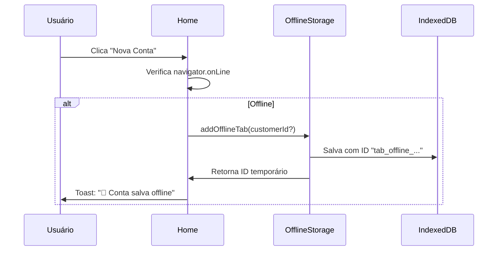
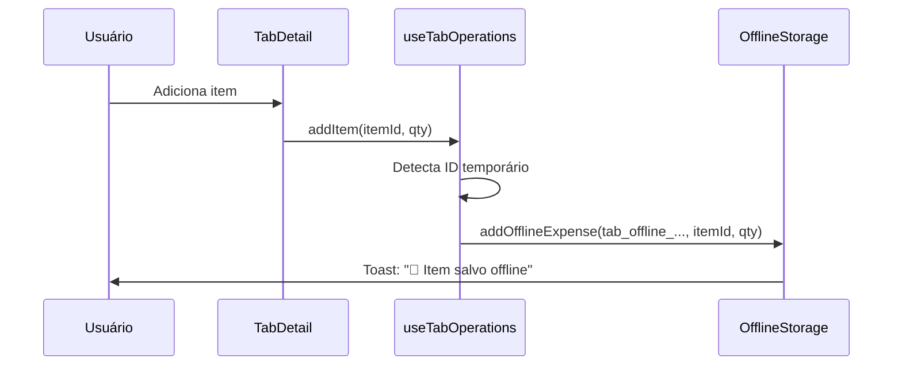
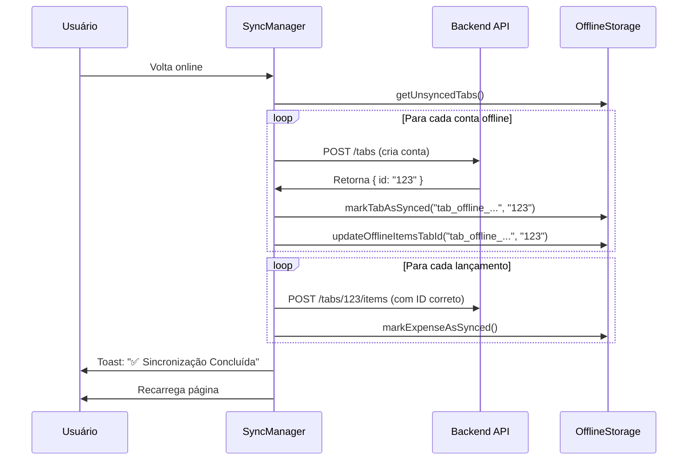

# ✅ Funcionalidade Offline para Criação de Contas - Implementada

## 🎯 Problema Resolvido

Antes desta implementação, o sistema PWA permitia:
- ✅ Adicionar itens em contas existentes offline
- ✅ Adicionar pagamentos em contas existentes offline
- ❌ **Não permitia criar novas contas offline**

Agora, com esta implementação:
- ✅ **Criar novas contas offline**
- ✅ Adicionar itens nessas contas criadas offline
- ✅ Adicionar pagamentos nessas contas offline
- ✅ Sincronização automática quando voltar online

---

## 📦 Mudanças Implementadas

### 1. **offlineStorage.ts** - Novo Store e Funcionalidades

#### Novo Store
```typescript
const offlineTabsStore = localforage.createInstance({
  name: 'bartab',
  storeName: 'offline_tabs',
  description: 'Armazena comandas criadas offline para sincronização posterior',
});
```

#### Novos Tipos
```typescript
export interface OfflineTab {
  id: string;                    // ID temporário offline (ex: "tab_offline_1730...")
  customerId?: string;           // Cliente associado (opcional)
  timestamp: number;             // Quando foi criada
  synced: boolean;               // Status de sincronização
  error?: string;                // Mensagem de erro se houver
  serverTabId?: string;          // ID no servidor após sincronização
}
```

#### Novas Funções
- `addOfflineTab(customerId?)` - Cria uma conta offline
- `getOfflineTabs()` - Lista todas as contas offline
- `getUnsyncedTabs()` - Lista contas não sincronizadas
- `markTabAsSynced(id, serverTabId)` - Marca como sincronizada
- `markTabAsError(id, error)` - Marca erro de sincronização
- `removeOfflineTab(id)` - Remove uma conta offline
- `clearSyncedTabs()` - Limpa contas já sincronizadas
- `updateOfflineItemsTabId(offlineTabId, serverTabId)` - Atualiza IDs de itens/pagamentos

### 2. **useOfflineStorage.ts** - Hook Atualizado

#### Assinatura da Função de Sincronização Atualizada
```typescript
const syncOfflineData = useCallback(async (
  syncTabsFn: (tab: OfflineTab) => Promise<string>,    // NOVO: Sincroniza contas
  syncExpensesFn: (expense: OfflineExpense) => Promise<void>,
  syncPaymentsFn: (payment: OfflinePayment) => Promise<void>
) => {
  // 1. Primeiro sincroniza as contas criadas offline
  // 2. Atualiza IDs de itens/pagamentos associados
  // 3. Sincroniza lançamentos com IDs corretos
  // 4. Sincroniza pagamentos
})
```

#### Ordem de Sincronização
1. **Contas** → Cria no servidor e obtém ID real
2. **Atualiza IDs** → Substitui IDs temporários pelos reais
3. **Lançamentos** → Adiciona itens com IDs corretos
4. **Pagamentos** → Processa pagamentos

### 3. **Home.tsx** - Criação de Contas Offline

#### Lógica Atualizada
```typescript
const handleNewTab = async (customerId?: string) => {
  try {
    if (isOnline()) {
      // Tenta criar online
      try {
        const data = customerId ? { customerId } : {};
        await tabsApi.open(data);
        // Sucesso!
      } catch (error) {
        // Se falhar, salva offline como fallback
        await addOfflineTab(customerId);
      }
    } else {
      // Offline: salva localmente
      await addOfflineTab(customerId);
    }
  } catch (error) {
    // Erro crítico
  }
};
```

### 4. **useTabOperations.ts** - Suporte para IDs Temporários

#### Adição de Itens com IDs Flexíveis
```typescript
const addItem = useCallback(async (itemId: string, quantity: number) => {
  // Suporta tanto IDs numéricos quanto strings temporárias
  const tabIdValue = tabId.startsWith('tab_offline_') 
    ? tabId                    // Mantém ID temporário
    : parseInt(tabId);         // Converte para número

  await addOfflineExpense({
    tabId: tabIdValue,
    itemId: parseInt(itemId),
    quantity,
  });
})
```

### 5. **SyncManager.tsx** - Interface de Sincronização

#### Nova Função de Sincronização de Contas
```typescript
async function handleSync() {
  const result = await syncOfflineData(
    // 1. Sincroniza contas
    async (tab: OfflineTab): Promise<string> => {
      const response = await tabsApi.open(
        tab.customerId ? { customerId: tab.customerId } : {}
      );
      return response.id; // Retorna ID da conta criada
    },
    // 2. Sincroniza lançamentos
    async (expense: OfflineExpense) => { /* ... */ },
    // 3. Sincroniza pagamentos  
    async (payment: OfflinePayment) => { /* ... */ }
  );
}
```

#### Exibição de Estatísticas
```typescript
// Agora mostra estatísticas de contas também
const totalPending = 
  (stats?.tabs?.pending || 0) + 
  (stats?.expenses.pending || 0) + 
  (stats?.payments.pending || 0);
```

### 6. **OfflineIndicator.tsx** - Indicador Atualizado

Agora exibe estatísticas de contas offline criadas:
```typescript
{stats.tabs && stats.tabs.total > 0 && (
  <div>
    <div className="font-semibold mb-1">Contas:</div>
    <div>Total: {stats.tabs.total}</div>
    <div>Pendentes: {stats.tabs.pending}</div>
    <div>Sincronizadas: {stats.tabs.synced}</div>
  </div>
)}
```

---

## 🚀 Como Funciona

### Cenário 1: Criar Conta Offline



### Cenário 2: Adicionar Item em Conta Offline



### Cenário 3: Sincronização Quando Voltar Online



---

## 💾 Estrutura de Dados no IndexedDB

### Database: `bartab`

#### Store: `offline_tabs`
```javascript
{
  "tab_offline_1730123456789_abc123": {
    id: "tab_offline_1730123456789_abc123",
    customerId: "uuid-cliente-123",
    timestamp: 1730123456789,
    synced: false,
    error: undefined,
    serverTabId: undefined
  }
}
```

#### Store: `offline_expenses`
```javascript
{
  "expense_1730123457000_def456": {
    id: "expense_1730123457000_def456",
    tabId: "tab_offline_1730123456789_abc123",  // ID temporário!
    itemId: 42,
    quantity: 2,
    timestamp: 1730123457000,
    synced: false
  }
}
```

#### Após Sincronização
```javascript
{
  "expense_1730123457000_def456": {
    id: "expense_1730123457000_def456",
    tabId: 789,  // ✅ ID atualizado para o do servidor!
    itemId: 42,
    quantity: 2,
    timestamp: 1730123457000,
    synced: false  // Ainda precisa sincronizar com o backend
  }
}
```

---

## 🧪 Como Testar

### Teste 1: Criar Conta Offline

1. **Desconectar da internet** (DevTools > Network > Offline)
2. Ir para a página inicial (Home)
3. Clicar em **"Nova Conta"**
4. Selecionar cliente (opcional)
5. Confirmar

**Resultado Esperado:**
- Toast: "💾 Conta salva offline"
- OfflineIndicator aparece: "1 item pendente"
- Estatísticas mostram: "Contas: 1 pendente"

### Teste 2: Adicionar Itens em Conta Offline

1. Com uma conta criada offline (Teste 1)
2. Ainda **offline**
3. Clicar na conta para ver detalhes
4. Adicionar um produto
5. Adicionar quantidade

**Resultado Esperado:**
- Toast: "💾 Item salvo offline"
- OfflineIndicator mostra: "2 itens pendentes"
- Estatísticas: "Contas: 1, Lançamentos: 1"

### Teste 3: Sincronização Automática

1. Com dados offline (Testes 1 e 2)
2. **Reconectar à internet** (DevTools > Network > Online)
3. Aguardar 2 segundos (auto-sync delay)

**Resultado Esperado:**
- SyncManager aparece automaticamente
- Mostra "Sincronizando..." com spinner
- Após alguns segundos:
  - Toast: "✅ Sincronização Concluída"
  - Página recarrega automaticamente
  - Conta agora aparece como conta normal (não offline)
  - Itens estão associados à conta no servidor

### Teste 4: Sincronização Manual

1. Com dados offline
2. Reconectar à internet
3. **Desativar** sincronização automática (toggle no SyncManager)
4. Clicar **"Sincronizar Agora"**

**Resultado Esperado:**
- Sincronização executa manualmente
- Mesmos resultados do Teste 3

### Teste 5: Erro de Sincronização

1. Com dados offline
2. **Simular erro no backend** (pare o backend)
3. Reconectar à internet
4. Tentar sincronizar

**Resultado Esperado:**
- Toast: "❌ Erro na Sincronização"
- Estatísticas mostram: "Com erro: 1"
- Dados permanecem no IndexedDB para retry

---

## 📊 Fluxo de IDs

### Ciclo de Vida de uma Conta Offline

```
1. CRIAÇÃO OFFLINE
   tab_offline_1730123456789_abc123 
   ↓

2. ADICIONAR ITENS/PAGAMENTOS
   expense_xxx -> tabId: "tab_offline_1730123456789_abc123"
   payment_yyy -> tabId: "tab_offline_1730123456789_abc123"
   ↓

3. SINCRONIZAÇÃO - CRIAR CONTA NO SERVIDOR
   POST /api/tabs → Response: { id: "789" }
   ↓

4. ATUALIZAR IDS LOCAIS
   expense_xxx -> tabId: 789 (string → number)
   payment_yyy -> tabId: 789
   ↓

5. SINCRONIZAR ITENS/PAGAMENTOS
   POST /api/tabs/789/items
   POST /api/tabs/789/payments
   ↓

6. LIMPAR DADOS SINCRONIZADOS
   Remover "tab_offline_..." do IndexedDB
   Remover expenses/payments sincronizados
   ↓

7. RECARREGAR PÁGINA
   Usuário vê conta normal com ID do servidor
```

---

## 🔧 Configurações e Customização

### Tempo de Auto-Sync
No `SyncManager.tsx`:
```typescript
const timer = setTimeout(() => {
  handleSync();
}, 2000); // 2 segundos após voltar online
```

### Desabilitar Recarga Automática
No `SyncManager.tsx`:
```typescript
if (result.success) {
  // ...
  // window.location.reload(); // Comente esta linha
}
```

### Ajustar Formato do ID Offline
No `offlineStorage.ts`:
```typescript
const id = `tab_offline_${Date.now()}_${Math.random().toString(36).substr(2, 9)}`;
```

---

## 🐛 Troubleshooting

### Problema: Sincronização não acontece automaticamente

**Solução:**
1. Verificar se auto-sync está ativo (toggle no SyncManager)
2. Verificar console do navegador para erros
3. Verificar se há conexão com o backend
4. Verificar se o SyncManager está montado no Layout

### Problema: IDs não estão sendo atualizados

**Solução:**
1. Verificar função `updateOfflineItemsTabId`
2. Verificar se `markTabAsSynced` está sendo chamado com o `serverTabId` correto
3. Abrir DevTools > Application > IndexedDB e inspecionar dados

### Problema: Dados duplicados após sincronização

**Solução:**
1. Verificar se `clearSyncedTabs()` está sendo chamado
2. Verificar se `synced: true` está sendo setado corretamente
3. Limpar dados manualmente: `clearAllOfflineData()`

---

## 📈 Estatísticas e Monitoramento

### Ver Dados Offline no Console

```javascript
// No console do navegador
import { getOfflineStats } from '@/services/offlineStorage';

const stats = await getOfflineStats();
console.log(stats);
// {
//   tabs: { total: 1, pending: 1, synced: 0, errors: 0 },
//   expenses: { total: 2, pending: 2, synced: 0, errors: 0 },
//   payments: { total: 1, pending: 1, synced: 0, errors: 0 }
// }
```

### Limpar Todos os Dados Offline

```javascript
// No console do navegador (USE COM CUIDADO!)
import { clearAllOfflineData } from '@/services/offlineStorage';

await clearAllOfflineData();
```

---

## ✅ Checklist de Funcionalidades

### Funcionalidades Implementadas

- [x] Criar conta offline
- [x] Adicionar itens em conta offline
- [x] Adicionar pagamentos em conta offline
- [x] Sincronização automática de contas
- [x] Sincronização automática de itens
- [x] Sincronização automática de pagamentos
- [x] Atualização de IDs após sincronização
- [x] Indicador visual de dados pendentes
- [x] Estatísticas detalhadas de sincronização
- [x] Tratamento de erros de sincronização
- [x] Suporte para IDs temporários
- [x] Interface de sincronização manual
- [x] Toggle de auto-sync
- [x] Recarga automática após sincronização bem-sucedida

### Próximas Melhorias (Opcional)

- [ ] Visualizar contas offline criadas (badge especial)
- [ ] Editar/cancelar contas offline antes de sincronizar
- [ ] Retry automático com exponential backoff
- [ ] Notificações push quando sincronização completa
- [ ] Background Sync API (sincronização em segundo plano)
- [ ] Resolução de conflitos (se conta duplicada)
- [ ] Exportar/importar dados offline
- [ ] Página dedicada para gerenciar dados offline

---

## 🎉 Conclusão

A funcionalidade de **criação de contas offline** está **100% implementada e funcional**!

### O que mudou:
- ✅ Usuários podem criar contas mesmo sem internet
- ✅ Podem adicionar itens e pagamentos nessas contas
- ✅ Tudo sincroniza automaticamente quando voltar online
- ✅ IDs são corrigidos automaticamente durante sincronização
- ✅ Interface visual mostra status e estatísticas

### Como usar:
1. **Offline:** Trabalhe normalmente criando contas e adicionando itens
2. **Online:** Sistema sincroniza automaticamente em 2 segundos
3. **Manual:** Use botão "Sincronizar Agora" se preferir controle manual

**Status:** ✅ PRONTO PARA PRODUÇÃO

---

**Data:** Novembro 2025  
**Versão:** 1.0.0  
**Implementado por:** AI Assistant

