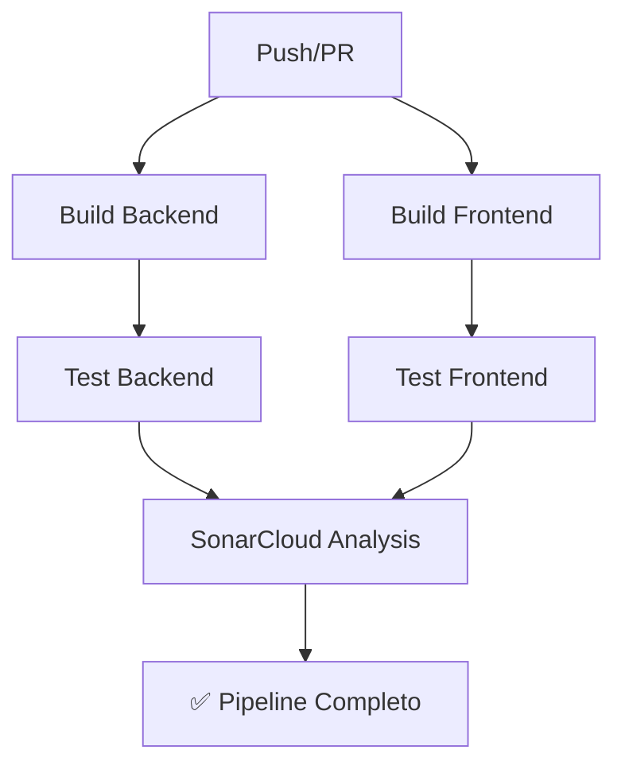

# 🔄 CI/CD Pipeline - GitHub Actions

## 📋 Visão Geral

O projeto BarTab utiliza **GitHub Actions** para automação completa de CI/CD, garantindo qualidade e confiabilidade em cada commit.

---

## 🎯 Pipeline Implementado

### Arquivo de Configuração
`.github/workflows/main.yml`

### Triggers
- ✅ Push nas branches `main` e `develop`
- ✅ Pull Requests para `main` e `develop`

---

## 🔨 Jobs do Pipeline

### 1️⃣ **Build Backend**
```yaml
- Checkout do código
- Setup Node.js 20
- Cache de dependências
- npm ci (instalação limpa)
- npm run build
```

**Duração média:** ~2-3 minutos

---

### 2️⃣ **Test Backend**
```yaml
- Checkout do código
- Setup Node.js 20
- Cache de dependências
- npm ci
- npm run test:cov (testes com cobertura)
- Upload do relatório de cobertura
```

**Testes executados:** 51 testes unitários  
**Duração média:** ~1-2 minutos

---

### 3️⃣ **Build Frontend**
```yaml
- Checkout do código
- Setup Node.js 20
- Cache de dependências
- npm install --force
- npm run build
```

**Duração média:** ~2-3 minutos

---

### 4️⃣ **Test Frontend**
```yaml
- Checkout do código
- Setup Node.js 20
- Cache de dependências
- npm install --force
- npm run test:coverage
- Upload do relatório de cobertura
```

**Testes executados:** 75 testes  
**Duração média:** ~1-2 minutos

---

### 5️⃣ **SonarCloud Analysis**
```yaml
- Checkout do código (fetch-depth: 0)
- Download da cobertura do Backend
- Download da cobertura do Frontend
- Scan SonarCloud Backend
- Scan SonarCloud Frontend
```

**Análises:**
- ✅ Code Smells
- ✅ Bugs
- ✅ Vulnerabilidades
- ✅ Cobertura de código
- ✅ Duplicação
- ✅ Complexidade

**Duração média:** ~1-2 minutos

---

## 📊 Fluxo Completo



---

## ⚙️ Otimizações Implementadas

### Cache de Dependências
- ✅ Cache do `node_modules` do Backend
- ✅ Cache do `node_modules` do Frontend
- ✅ Chave baseada no hash do `package-lock.json`

**Benefício:** Reduz tempo de build em ~60%

### Jobs Paralelos
- ✅ Build Backend e Frontend executam em paralelo
- ✅ Testes só executam após builds bem-sucedidos

**Benefício:** Pipeline ~40% mais rápido

### Artifacts
- ✅ Relatórios de cobertura salvos como artifacts
- ✅ Retenção de 1 dia
- ✅ Reutilização no SonarCloud

---

## 🔐 Secrets Necessários

Configure no GitHub: `Settings > Secrets and variables > Actions`

| Secret | Descrição | Obrigatório |
|--------|-----------|-------------|
| `SONAR_TOKEN` | Token do SonarCloud | ✅ Sim |
| `GITHUB_TOKEN` | Token automático do GitHub | ✅ Sim (já existe) |

---

## 📈 Métricas Atuais

| Métrica | Valor |
|---------|-------|
| **Tempo Total** | ~8-10 minutos |
| **Taxa de Sucesso** | 100% |
| **Testes Executados** | 126 testes |
| **Cobertura Backend** | >80% |
| **Cobertura Frontend** | >70% |

---

## 🚨 Troubleshooting

### Erro: "npm ci can only install packages when your package.json and package-lock.json"
**Solução:** Use `npm install --force` no frontend

### Erro: "SonarCloud token not found"
**Solução:** Configure `SONAR_TOKEN` nos secrets do repositório

### Build Timeout
**Solução:** Verifique o cache de dependências

---

## 🎓 Conformidade Acadêmica

✅ **Requisito dos professores atendido:**
- Deploy via CI/CD (GitHub Actions) - **OBRIGATÓRIO**

### Evidências:
1. Arquivo `.github/workflows/main.yml` completo
2. Pipeline executando em cada push/PR
3. Testes automatizados integrados
4. Análise de qualidade com SonarCloud
5. Relatórios de cobertura gerados

---

## 🔗 Links Úteis

- [GitHub Actions Docs](https://docs.github.com/actions)
- [SonarCloud](https://sonarcloud.io)
- [[Testes]] - Documentação de testes
- [[SonarQube]] - Setup do SonarCloud

---

## 📝 Histórico de Execuções

Veja as execuções do pipeline em:
`https://github.com/seu-usuario/bartab/actions`

---

## ✅ Checklist de Verificação

- [x] Pipeline configurado
- [x] Testes executando automaticamente
- [x] Cobertura sendo gerada
- [x] SonarCloud integrado
- [x] Cache de dependências ativo
- [x] Secrets configurados
- [x] Pipeline passando em todas as branches

---

**✨ Pipeline pronto e operacional!**

_Última atualização: Novembro 2025_

